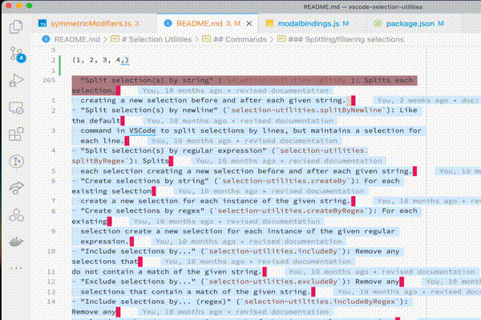

# Selection Utilities

This extension provides a series of utilities for manipulating, saving and creating both single and
multiple selections, inspired by [Kakoune](http://kakoune.org/).

There are many commands, and they are designed to work together. They work well in conjunction with
[vscode-modal-keys](https://github.com/haberdashPI/vscode-modal-keys).

Because there are so many commands, and any given set of keybindings for this
extension could easily overwrite existing bindings, there are no default
keybindings; you will need to learn about commands you want to use and then
customize them yourself.

## Commands

### Changing the Active and Anchor positions of a Selection

[Read more](https://haberdashpi.github.io/vscode-selection-utilities/stable/exchange.html)

### Selection Motions

These commands allow the active selection to moved by or extend by particular units (word,
paragrpah etc...).

[Read more](https://haberdashpi.github.io/vscode-selection-utilities/stable/motions.html)

### Saving selections

These commands save a selection for later, or add any arbitrary selection to a list of
soon-to-be multiple selections. 

[Read more](https://haberdashpi.github.io/vscode-selection-utilities/stable/motions.html)

### Adding and removing selections

While VSCode comes with a way to add or remove multiple selections (Ctrl/Cmd - D) the
following commands provide a bit more flexibility in this behavior by introducing the notion
of a "primary" selection. You can remove the primary selection and you can add new
selections relative to this primary selection.

[Read more](https://haberdashpi.github.io/vscode-selection-utilities/stable/primary.html)

### Splitting/filtering selections

These commands split, create or filter selections according to tokens. The tokens to use can be provided by the user via an input box, or you can pass it in the argument `text` when defining the command to call.

[Read more](https://haberdashpi.github.io/vscode-selection-utilities/stable/split_filter.html)

### Shrinking selections

These commands modify the start and end of selections.

[Read more](https://haberdashpi.github.io/vscode-selection-utilities/stable/shrink.html)

### Editing Text by Selection

[Read more](https://haberdashpi.github.io/vscode-selection-utilities/stable/edit_text.html)

## Related projects

- [Dance](https://github.com/71/dance)
- [Piped Regex](https://github.com/akashsaluja/piped-regex-vscode)
- [Filter Lines](https://github.com/everettjf/vscode-filter-line)
- [Better Align](https://github.com/WarWithinMe/better-align)